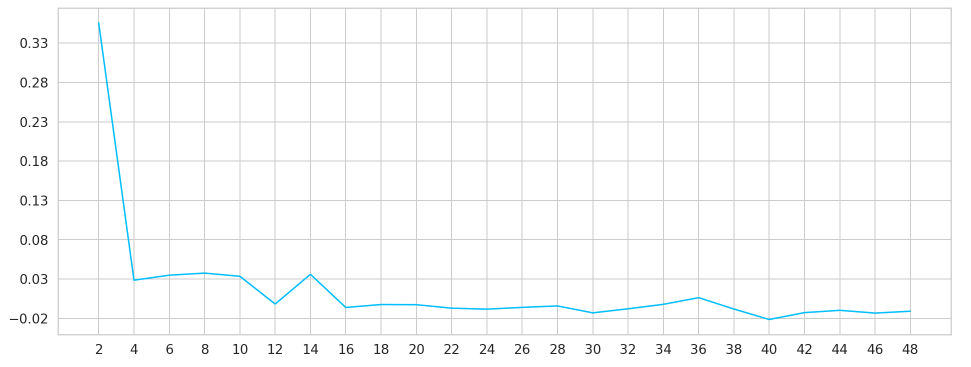

# movie-recommender
The objective is to develop a simple movie recommender model that leverages user-ratings to recommend unseen movies to the users. Based on the movie-rating patterns of users, different clusters are formed. Each cluster groups together users with similar movie choices and ratings. This knowledge is later used to provide personalized movie recommendations. The data is collected from MovieLens dataset (small), which contains 100,000 ratings of 9000 movies (rated by 600 users) and can be found in the following link:
https://grouplens.org/datasets/movielens/latest/

• Different EDA has been performed to find out genres with the highest-average ratings, genres rated by most users. 
• K - means clustering is performed to find out clusters with users having similar ratings. 
• The value of K is determined using the Silhouette score. 
• Personalized recommendation is given based on cluster analysis. 

### Popular Genre

### Visualizing User Ratings 

### Determining the value of k (Elbow method)

### Recommending Movies to a User

# How to run:
Please check the Movie_Recommender.ipynb file for the detailed analysis.
